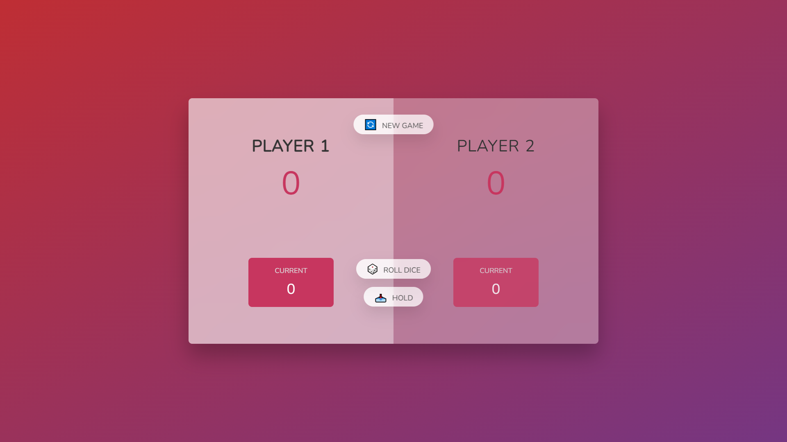
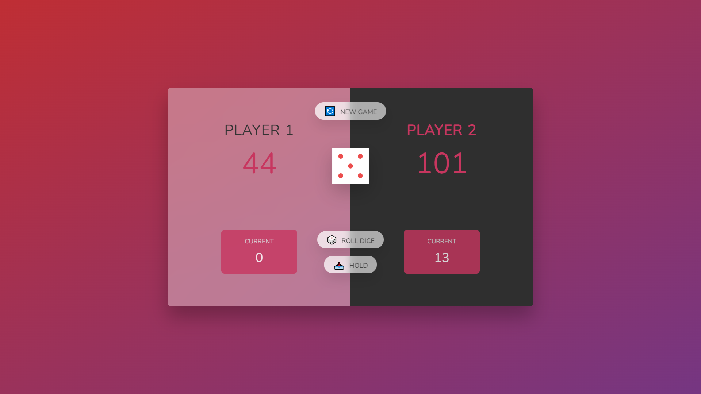

# Pig Game

TODO: Adicionar a funcionalidade de game reset.

Pig game é um simples jogo onde vence quem fizer 100 pontos primeiro.

O jogo foi feito durante o aprendizado de manipulação do DOM.

Para executar o jogo basta abrir o arquivo index.html ou acessar o [**link**](https://try-pig-game.netlify.app/)

Regras Básicas do jogo

- Vence quem fizer 100 pontos primeiro.
- Caso o dado sorteado seja 1, você perde os current pooints atuais.
- O botão hold serve para "segurar" os pontos que você já tem nos current points.

#
